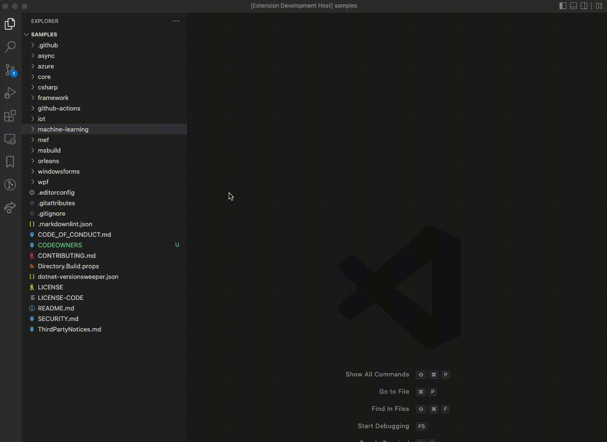

# codeownersearch

Search files with ripgrep and codeowners.

## Features

## Requirements

You need a `CODEOWNERS` file in the root of your repository as well as [ripgrep](https://github.com/BurntSushi/ripgrep) installed.

## Known Issues

Currently none.

## Release Notes

### 1.0.0

Initial release of codesearch
